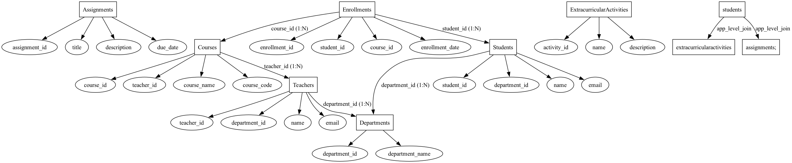

# DBGenie Entity Relationship Visualizer
 Database entity-relationship schema visualizer

## Overview

DBGenie is an advanced database schema visualization tool that eliminates incomplete ER diagrams by detecting both explicit and implicit relationships. It directly connects to SQL databases, extracts schemas, and maps foreign key relationships, while also parsing SQL query logs to uncover hidden application-level connections.

## Key Features

1. Automated ER Diagram Extraction → Directly connects to SQL databases, retrieves schema details, and generates ER diagrams without manual intervention.
2.  Hybrid Relationship Detection → Combines foreign key constraints with SQL query analysis to capture implicit relationships.
3.  No Orphaned Entities → Ensures all database tables are logically connected, even if foreign keys are missing.
4.  User-Defined SQL Input → Allows developers to input custom SQL queries to establish missing links between entities.
5.  Interactive ERD Generation → Uses Graphviz to generate clear, structured diagrams.

## System Architecture
## Module Overview

| **Module**              | **Functionality**  |
|-------------------------|----------------------------------------------------------------|
| **Database Module**     | Connects to MySQL, retrieves schema details, and executes queries to fetch tables, columns, and relationships. |
| **SQL Parser Engine**   | Extracts entity-relationship data directly from the database and parses SQL queries for hidden relationships. |
| **Generator Module**    | Transforms schema data and parsed relationships into structured ER diagrams. Uses the **Graphviz** library of python.|

## 🛠️ User Walkthrough  

This section provides a step-by-step guide on how to use **DBGenie** to generate **Entity-Relationship (ER) diagrams** from a MySQL database, including the ability to add application-level relationships.  

### 1️⃣ Running the Tool  

To start **DBGenie**, navigate to the project directory and run:  

```sh
python -u "/path/to/DBGenie_er_visualizer/DBGenie_schemaviz/sql-er-diagram-generator/src/main.py"
MySQL Connection Details:
Host (default: localhost): 
Username (default: root): 
Password: 

Available databases:
1. db1
2. db2
3. db3
...
15. school_db
16. db4
17. db5
18. db6

Select database number: 15 //User Input
Generating ER diagram based on database structure...
Database ER diagram generated successfully!

Would you like to add application-level relationships? (y/n): y //User Input
Enter application-level queries (one per line, empty line to finish):
select * from students join assignments;

Generating updated ER diagram with application-level relationships...
Updated ER diagram generated successfully!
```

## Demo output 


## Prerequisites
Before running DBGenie, ensure you have the following installed on your system:

1. Python 3.x
2. MySQL Server (Required for database connection)
3. Required Python libraries: mysql-connector-python, graphviz, sqlparse

## Install MySql (If not installed) 

For Windows:

Download MySQL Community Server from MySQL Official Website.
Install and configure MySQL, ensuring the MySQL service is running.
Add MySQL to system PATH for command-line access.

For Linux: 
```bash
sudo apt update
sudo apt install mysql-server
sudo systemctl start mysql
sudo mysql_secure_installation
```
For MacOS:
```bash
brew install mysql
brew services start mysql
```

## Future Enhancements

1. Support other SQL databases(PosgresSQL, SQLite, etc) and NoSQL Databases
2. Cloud-Based ER Diagram Generation
3. AI-Powered Natural Language based inputs for ER generation


